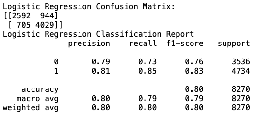
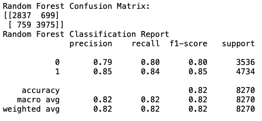
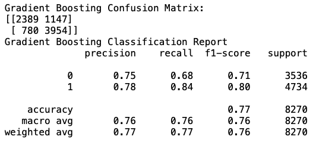

# NLP-Amazon-Beauty-Reviews
Predicting Amazon beauty product ratings through natural language processing of beauty product reviews.

## Table of Contents
1. [Description](#description)
2. [Data Overview](#DataOverview)
3. [Data Preparation](#DataPreparation)
4. [Exploratory Data Analysis](#ExploratoryDataAnalysis)
5. [Modeling](#Modeling)
6. [Summary](#Summary)

## Description 
Amazon is an ecommerce site known primarily for its sale of various goods. Many customers like to leave feedback on their products as well as a rating from 1 through 5 indicating their satisfaction or lackthereof. Natural Language Processing has been often used on review text data like that of Amazon's. By processing the review text into tokens of words, we can calculate the sentiment in each review and therefore predict ratings of the review. In doing so, I hope to use user sentiment data from beauty product reviews to predict what makes a user consider a beauty product on Amazon as a perfect rating.

## Data Overview 
UCSD has provided a [dataset](https://nijianmo.github.io/amazon/index.html) of over 36,000 rows of user reviews from September 2005 to September 2018. The features in this dataset do not include the name of the item being reviewed, but it includes ratings, reviewer ID and name, the style of the item a time in which the reviews was posed and review text.

**overall:** Rating of product from 1 through 5.

**verified:** Boolean value of whether or not user purchased the item under review.

**reviewTime** Object value of time. Converted to datetime.

**reviewerID:** Unique user id int.

**asin:** String product id.

**style:** Set or dictionary of product style information.

**reviewerName:** String of username or handle.

**reviewText:** String of user review text.

**summary:** String of user review title.

**unixReviewTime** Int of unix time of review.

**vote:** Value(s) of whether or not the current review was helpful to others.

**image:** Links to user review images.

**processed_text:** String of user reviewText with special characters removed.

**review_type:** Binary representation of 0 and 1s where 0 is ratings 1 through 4 and 1 is a perfect rating of 5.

## Data Preparation 
Cleaning the data required some light EDA. I discovered 1200 rows of duplicate reviews, which I removed. I turned all of the reviewText column into strings before I removed stopwords, punctiation and special characters if any. I then changed the casing of the words to lowercase before tokenizing the words into single words.

## Exploratory Data Analysis 

### The Average Reviewer

Reviews aggregated by month and then by years. Some patterns we see are that mored reviews are posted in the spring around March, summer around July and Fall around Black Friday and the holiday season.

Most reviews came in around 2016 -- the review data ends in September 2018 so it’s not complete and looks much lower than what it could be especially since we know that things typically pick up for Amazon for holiday shopping.

Here we have the distribution of how many ratings are given by their score. 5-stars are given most often and so they will be what we want to determine today. What words tell us that our customer loves our product so that we may recommend these items to others?

Equally important, I wanted to observe who of our reviewers actually bought the product they’re reviewing. Both graphs similarly represent that the number of reviews posted gets higher the more a person likes a product. Yet, we notice that 5-star reviews are the highest of the verified buyers. Might this mean that these reviews are more credible? I don’t know -- It’s something to look into as a next steps

### Top Words
This is a word cloud representing the most common words in all beauty reviews in this dataset. Words like one, use and product are used most often.

Here these are the top 100 words for Perfect ratings. Users tend to talk more about the product in detail with heavy use of the word love and descriptive words that accentuate how these products affected users.

## Modeling 

My goal is to classify Perfect (5-star) ratings based on reviews. In order to do that, I split review text into two categories--those of which are 5-star Perfect ratings and those that are not (ratings 1 through 4). I implemented logistic regression, gradient boosting, and random forest models on my training and test sets of the cleansed and tokenized reviews.

### Findings

In the binary sense, 0 is Not Perfect and 1 is Perfect. After applying the models to my train(0.75) and test(0.25) data, I calculated the confusion and classification tables. Along the target: 1 for each table is where we can see the precision and recall scores as well as the F-1 scores.

Precision defines how accurate we are through the number of true perfects over false perfects.

Recall is the true perfect counts over the number of true perfects plus false perfects.

#### Base Model

The base model is set to predict the "most frequent" result--which in our case is a perfect rating.

     
Logistic regression made an attempt to predict five star ratings but didn’t do much better.

#### Logistic Regressoion

Hyperparameter tuning allowed gradient boosting to perform much better as opposed to the base model and logistic regression.

#### Gradient Boosting

Random forest performed the best overall in terms of precision and recall.

#### Random Forest

## Summary 

     

Ultimately, random forest appears to be the better model as its precision score is higher and  having false negatives is less of a concern--meaning that if we falsely identified a 5-star rating as not perfect, then that would still be acceptable. I was surprised and delighted to see random forest perform so well. I can see why it is often a favorite model. In terms of next steps, I am excited to see how I can utilize the extra features of the data set such as "verified". Though I cannot yet prove it, I hope there is something meaningful in a user's ratings and reviews based on whether or not they are a verified buyer of the product in question. Additionally, I would like to see how to use these ratings to reccommend products to other users of similar tastes.
